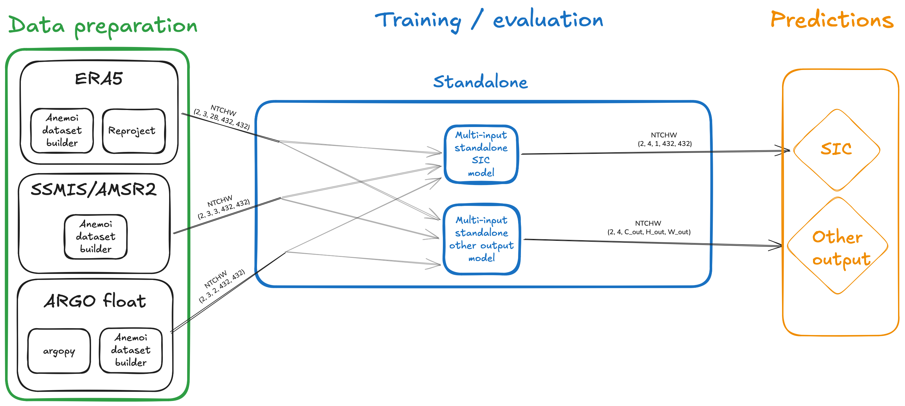
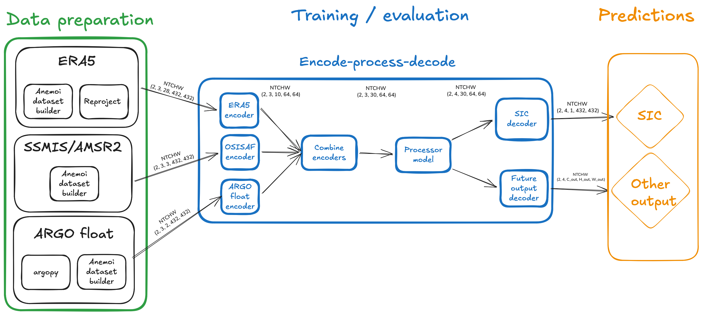

# Add a model

## Tensor format

All IceNet-MP models operate on tensors in `NTCHW` format:

| Dimension | Meaning |
|-----------|---------|
| `N` | Batch size |
| `T` | History steps (inputs) or forecast steps (outputs) |
| `C` | Channels / variables |
| `H` | Height |
| `W` | Width |

`N` and `T` are the same across all inputs, but `C`, `H`, and `W` may differ per dataset.

For example, with 3 history steps, and 4 forecast steps, each of the `k` inputs each have shape `(N, 3, C_k, H_k, W_k)` and the output has shape `(N, 4, C_out, H_out, W_out)`.

## Standalone models

A standalone model accepts a `dict[str, TensorNTCHW]` mapping dataset names to tensors and produces output of shape `(N, T, C_out, H_out, W_out)`.
Each model instance is typically trained to predict a single output, although this is not a hard constraint.



| | |
|---|---|
| **Pros** | All input variables available without transformation. |
| **Cons** | Combining datasets of different shapes or types must be done inside the model. |

## Processor models

A processor model sits inside an encode-process-decode pipeline.
You define a latent space `(H_latent, W_latent)` and the framework automatically creates one encoder per input and one decoder per output.

1. Each dataset-specific **encoder** maps input `(N, T_history, C_k, H_k, W_k)` to `(N, T_history, C_k_latent, H_latent, W_latent)`.
2. The `k` encoded tensors are fused to `(N, T_history, C_latent, H_latent, W_latent)`.
3. The **processor** maps `(N, T_history, C_latent, H_latent, W_latent)` to `(N, T_forecast, C_latent, H_latent, W_latent)`.
4. Each output-specific **decoder** maps the processor output, `(N, T_forecast, C_latent, H_latent, W_latent)`, to `(N, T_forecast, C_out, H_out, W_out)`.



| | |
|---|---|
| **Pros** | Inputs are converted into a common latent space, freeing up the model to learn time evolution. |
| **Cons** | Latent space representation may lose some spatial correlations present in the inputs. |

## Fusing multiple encoded inputs

`EncodeProcessDecode` uses `LatentFusion` between the encoders and processor. With no `fusion` configuration, `mode: concat` is used and reproduces the previous channel concatenation behaviour exactly.

To make fusion data-dependent, configure attention mode:

```yaml
fusion:
  _target_: icenet_mp.models.common.LatentFusion
  mode: attention
  temperature: 1.0
```

Attention fusion spatially pools each encoded input stream for every sample and history timestep, learns one score per stream, normalises the scores across streams, and reweights each stream before concatenation. It preserves the original channel ordering and total channel count, so existing processors, decoders, and target-channel offsets remain compatible.

The attention score heads are zero-initialised. The initial stream weights are therefore all `1`, making the first forward pass exactly equal to ordinary concatenation. This also makes the option compatible with multistage pretraining: encoder, decoder, and processor stages can use the existing concatenated latent representation, then end-to-end finetuning starts from the same representation while the attention weights become trainable.

A ready-to-run example is available as `model=cnn_unet_cnn_attention`.
