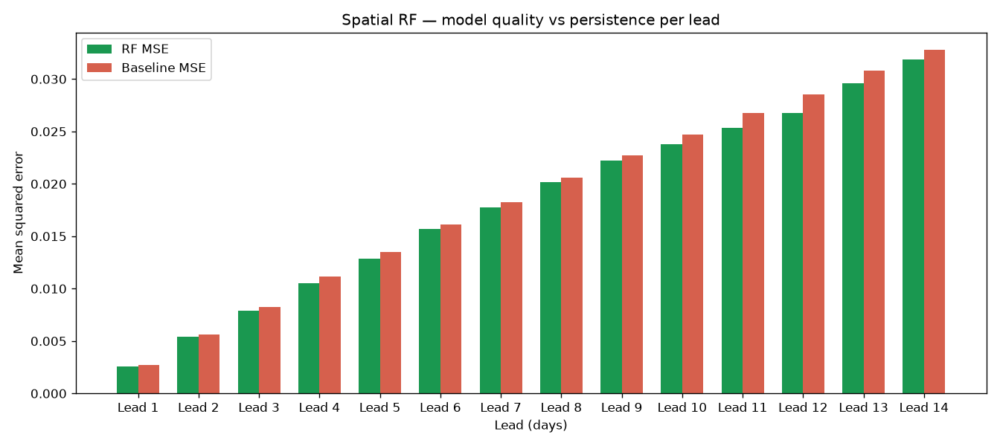
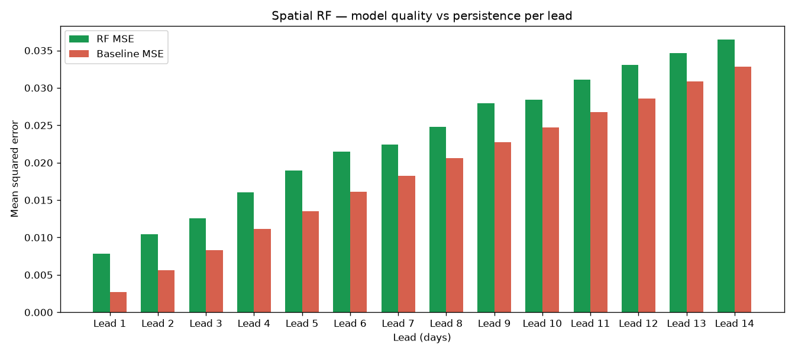
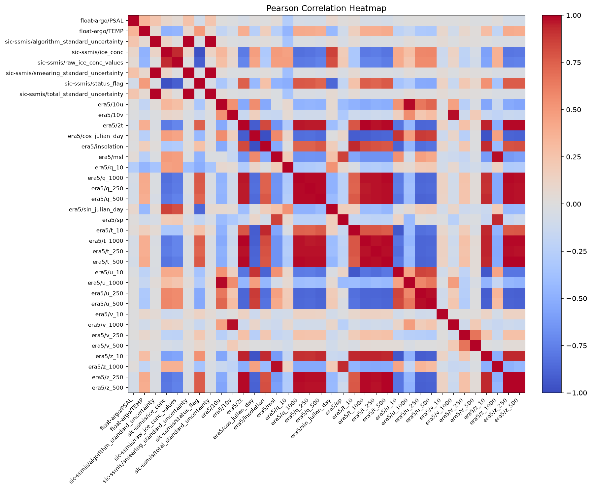
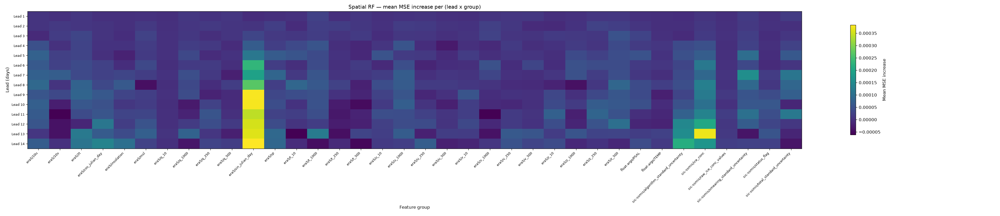
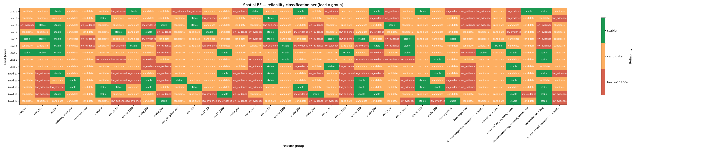
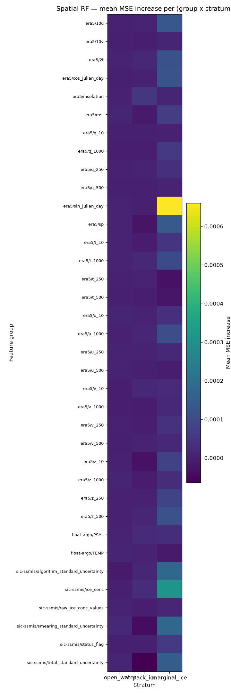

# Feature screening demonstration: full year 2020 run

This page runs the recommended screening config against one full year of
real full-north data, side-by-side for the new `sic_change` target and the
alternative `absolute` target, and walks through what the outputs look like
and what the new additions on this branch are doing.

The runs use the data group `data=full_north_from_1999`. The full evidence
reports and intermediate artefacts are in:

```
outputs/demo_year_2020_sic_change_20260812/
outputs/demo_year_2020_absolute_20260812/
```

The plots referenced below are in `docs/src/assets/feature-screening-demo/`.

## Setup

The two runs use the same recommended config (`rf_screening/03_feature_screening`)
and the same training/validation windows (train: 2020-01-01 to 2020-12-31,
validate: 2021-01-01 to 2021-12-31). The only difference is the target mode
(overridden via `rf.target_mode` for the second run, since the recommended
default is now `sic_change`).

```bash
# Default config (sic_change target)
uv run imp pre-feature-analysis \
  --config-name rf_screening/03_feature_screening \
  --output-dir outputs/demo_year_2020_sic_change_20260812 \
  platform=<your-platform> \
  data/split=quick_2yr_from_1999 \
  ++data.split.train.0.start=2020-01-01 \
  ++data.split.train.0.end=2020-12-31 \
  ++data.split.validate.0.start=2021-01-01 \
  ++data.split.validate.0.end=2021-12-31 \
  ++vif.max_samples=1000 \
  ++pca.max_samples=1000 \
  ++eof.max_samples=1000 \
  rf.n_estimators=100 \
  rf.n_jobs=-1 \
  rf.spatial.locations_per_stratum=8 \
  rf.spatial.max_initialisations=200 \
  rf.spatial.max_rows=4800 \
  rf.spatial.permutation_repeats=3 \
  rf.spatial.plot_results=true

# Alternative target mode (absolute, for comparison)
uv run imp pre-feature-analysis \
  --config-name rf_screening/03_feature_screening \
  --output-dir outputs/demo_year_2020_absolute_20260812 \
  platform=<your-platform> \
  data/split=quick_2yr_from_1999 \
  ++data.split.train.0.start=2020-01-01 \
  ++data.split.train.0.end=2020-12-31 \
  ++data.split.validate.0.start=2021-01-01 \
  ++data.split.validate.0.end=2021-12-31 \
  ++vif.max_samples=1000 \
  ++pca.max_samples=1000 \
  ++eof.max_samples=1000 \
  rf.target_mode=absolute \
  rf.n_estimators=100 \
  rf.n_jobs=-1 \
  rf.spatial.locations_per_stratum=8 \
  rf.spatial.max_initialisations=200 \
  rf.spatial.max_rows=4800 \
  rf.spatial.permutation_repeats=3 \
  rf.spatial.plot_results=true
```

**Run provenance** (both runs):

| Field | Value |
|---|---|
| Effective samples | 4,800 |
| Feature count | 108 (36 variables × 3 history steps) |
| Initialisation count | 200 (drawn from 2020-01-01 to 2020-12-15; tail-trimmed to leave 14 forecast days) |
| Tree count | 100 |
| Permutation repeats | 3 |
| Temporal folds | 5 (TimeSeriesSplit, lead-aware purging) |
| Spatial strata | open water (SIC < 0.15), marginal ice, pack ice (SIC > 0.80) |
| Locations per stratum | 8 |

The `sic_change` run also passes the VIF qualification gate
(1,000 samples / 36 features = 27.8:1, well above the 10:1 minimum).
The same data and same `++vif.max_samples=1000` are used for both runs,
so the VIF/PCA/EOF numbers below are identical between the two outputs.

## Headline: `sic_change` is the only mode where the RF actually screens anything

The model-qualification table tells the whole story. The same RF budget
is used in both runs; only the target changes. With `target_mode: sic_change`
the RF beats persistence at every lead from 1 to 14. With
`target_mode: absolute` the RF is *worse* than persistence at every lead —
and the gap is largest at the short leads where weather/ocean inputs
should matter most.

| Lead | `sic_change` RF MSE | `sic_change` Persistence MSE | `sic_change` Skill | `absolute` RF MSE | `absolute` Persistence MSE | `absolute` Skill |
|---:|---:|---:|---:|---:|---:|---:|
|  1 | 0.002550 | 0.002703 | **+5.7%** | 0.007830 | 0.002703 | **−189.6%** |
|  2 | 0.005445 | 0.005615 | +3.0% | 0.010437 | 0.005615 | −85.9% |
|  3 | 0.007890 | 0.008273 | +4.6% | 0.012543 | 0.008273 | −51.6% |
|  5 | 0.012836 | 0.013471 | +4.7% | 0.018943 | 0.013471 | −40.6% |
|  7 | 0.017752 | 0.018216 | +2.5% | 0.022428 | 0.018216 | −23.1% |
| 10 | 0.023750 | 0.024708 | +3.9% | 0.028378 | 0.024708 | −14.9% |
| 14 | 0.031892 | 0.032812 | +2.8% | 0.036483 | 0.032812 | −11.2% |

Skill is `(persistence_mse − rf_mse) / persistence_mse`; positive means the
RF beats persistence. The `sic_change` run improves on persistence at every
lead, with the largest gain at lead 1 (5.7%). The `absolute` run is worse
than persistence at every lead, with the catastrophic loss concentrated at
the short leads (190% worse at lead 1, 86% worse at lead 2).

The reason is visible in the top-of-list importance for each target:

| Lead | `sic_change` — top 3 groups by importance | `absolute` — top 3 groups by importance |
|---:|---|---|
|  1 | `era5/t_1000`, `sic-ssmis/total_standard_uncertainty`, `sic-ssmis/smearing_standard_uncertainty` | `sic-ssmis/ice_conc`, `sic-ssmis/algorithm_standard_uncertainty`, `sic-ssmis/status_flag` |
|  5 | `era5/sin_julian_day`, `sic-ssmis/smearing_standard_uncertainty`, `era5/10u` | `sic-ssmis/ice_conc`, `sic-ssmis/algorithm_standard_uncertainty`, `sic-ssmis/status_flag` |
| 14 | `era5/sin_julian_day`, `sic-ssmis/algorithm_standard_uncertainty`, `sic-ssmis/ice_conc` | `sic-ssmis/ice_conc`, `sic-ssmis/algorithm_standard_uncertainty`, `era5/sin_julian_day` |

With `target_mode: absolute` the target is "future SIC", and the latest
historical SIC (`sic-ssmis/ice_conc`) is by far the best single predictor
of the absolute future value at every lead. The RF concentrates ~95% of
its importance on that one feature, and the rest of the field becomes
invisible to it. The screening output reduces to "ice_conc is important,
everything else is noise" — which is true, but useless for the question
"which weather/ocean variables should I include in my neural model?".

With `target_mode: sic_change` the target is "future SIC − latest historical
SIC", and the persistence signal is removed by construction. The RF is
forced to use the other variables, and a real ranking emerges: at lead 1
the leading variable is `era5/t_1000` (1000-hPa air temperature), at lead
5/14 the leading variable is `era5/sin_julian_day` (seasonal cycle, which
is meaningful in marginal ice).

The `model_quality.png` plots below make this concrete.





In the `sic_change` plot the RF MSE (green) is just below the persistence
MSE (orange) at every lead; in the `absolute` plot the RF MSE is dramatically
higher than persistence at short leads and only catches up by lead 14 where
absolute SIC and SIC-change are nearly the same signal.

## What `importance_policy: always` does for the `absolute` run

In the `absolute` run the RF loses to persistence at every lead, but the
report still contains a complete per-variable importance table, reliability
labels, and recommendations — because the recommended config sets
`importance_policy: always` and the evidence report treats
model-qualification and variable-importance as separate concerns. The
opening lines of the `absolute` report's `spatial_rf_report.txt` are:

```
Lead 1
  RF MSE/MAE: 0.007830 / 0.055241
  Persistence MSE/MAE: 0.002703 / 0.025600
  Model-quality context: RF did not beat persistence; importance is retained for exploratory screening.
  Grouped permutation importance (mean MSE increase ± fold standard deviation):
    sic-ssmis/ice_conc: 0.013461 ± 0.002789
    sic-ssmis/algorithm_standard_uncertainty: 0.000859 ± 0.000596
    ...
```

The "importance is retained for exploratory screening" line is the policy
doing its job: the user can see the RF rankings, the reliability labels,
and the recommendations for the `absolute` run, with the model-quality
context (RF did not beat persistence) right above the table. Without
`importance_policy: always` set, the policy would default to `qualified`,
which would have suppressed every importance row in this case and emitted
an `inconclusive` recommendation for every variable — which is honest
but useless.

## VIF, PCA, EOF and the correlation heatmap

**VIF** (1,000 samples, 36 features, both runs identical — qualified):

30 of the 36 input variables are above the multicollinearity threshold
(VIF > 5). The leading offenders are the SIC uncertainty fields
(`sic-ssmis/total_standard_uncertainty` 15962, `sic-ssmis/algorithm_standard_uncertainty`
15332) and the era5 geopotential / temperature / humidity columns
(`era5/z_250` 12501, `era5/t_1000` 5137, `era5/2t` 5128, `era5/z_500` 4991).

| Variable | VIF |
|---|---:|
| `sic-ssmis/total_standard_uncertainty` | 15,962.3 |
| `sic-ssmis/algorithm_standard_uncertainty` | 15,332.0 |
| `era5/z_250` | 12,501.1 |
| `era5/t_1000` | 5,137.2 |
| `era5/2t` | 5,128.8 |
| `era5/z_500` | 4,991.5 |
| `era5/t_500` | 4,504.6 |
| `era5/cos_julian_day` | 2,125.9 |
| `era5/insolation` | 1,607.5 |
| `era5/msl` | 940.3 |
| `sic-ssmis/ice_conc` | 86.7 |
| `era5/u_500` | 81.5 |
| `era5/u_250` | 57.1 |
| `sic-ssmis/status_flag` | 47.3 |
| `era5/q_10` | 2.9 (below threshold) |
| `era5/v_500` | 2.5 (below threshold) |
| `float-argo/TEMP` | 1.8 (below threshold) |
| `float-argo/PSAL` | 1.4 (below threshold) |
| `era5/v_10` | 1.1 (below threshold) |

**PCA** (same 1,000 samples): 7 components for 90.5% of variance. PC1 alone
is 49.2% — the data is dominated by a single large-scale mode (seasonal +
spatial mean).

**EOF**: 2 modes for 95.6% of variance (Mode 1: 57.2%, Mode 2: 38.4%).
The variable-space EOF is descriptive only and is excluded from
independent feature-selection evidence (see [Run feature screening](feature-screening.md#how-it-works)).

**Top correlations** (from `correlations/correlations.csv`):

| Pair | Pearson |
|---|---:|
| `sic-ssmis/algorithm_standard_uncertainty` ↔ `sic-ssmis/total_standard_uncertainty` | 0.9998 |
| `era5/2t` ↔ `era5/t_1000` | 0.9996 |
| `era5/t_500` ↔ `era5/z_250` | 0.9983 |
| `era5/z_250` ↔ `era5/z_500` | 0.9981 |
| `sic-ssmis/smearing_standard_uncertainty` ↔ `sic-ssmis/total_standard_uncertainty` | 0.9954 |
| `sic-ssmis/algorithm_standard_uncertainty` ↔ `sic-ssmis/smearing_standard_uncertainty` | 0.9954 |
| `era5/t_500` ↔ `era5/z_500` | 0.9939 |
| `era5/q_1000` ↔ `era5/q_250` | 0.9903 |
| `era5/t_1000` ↔ `era5/z_500` | 0.9901 |
| `era5/2t` ↔ `era5/z_500` | 0.9900 |

The high correlations are physically meaningful: `total_standard_uncertainty`
is the combined uncertainty; `2t` and `t_1000` are surface and 1000-hPa
air temperature; `z_250` and `z_500` are geopotential at adjacent pressure
levels. The pipeline correctly identifies known physical redundancies
rather than spurious statistical coincidences.



## Top recommendations (`sic_change` run)

The `evidence/parameter_evidence.md` table is large (36 variables × 14
leads × 4 strata = 2,016 rows); the **reliability** and **recommendation**
columns are the consolidated output. The distribution across the whole
run is:

| Reliability | Rows | Share |
|---|---:|---:|
| `stable` (positive importance in ≥4/5 folds AND rank-stable) | 309 | 15% |
| `candidate` (positive importance but rank-unstable) | 1,033 | 51% |
| `low_evidence` (mean importance ≤ 0) | 674 | 34% |
| **Total** | **2,016** | **100%** |

| Recommendation | Rows | Share |
|---|---:|---:|
| `retain` (positive AND stable) | 640 | 32% |
| `investigate` (positive BUT rank-unstable) | 702 | 35% |
| `deprioritise` (mean importance ≤ 0) | 674 | 33% |
| **Total** | **2,016** | **100%** |

The top 10 variables by total `retain` count across all (lead, stratum)
combinations:

| Variable | Retain / Total | Top retain stratum |
|---|---:|---|
| `era5/cos_julian_day` | 40 / 56 | open_water |
| `era5/u_10` | 32 / 56 | pack_ice |
| `sic-ssmis/raw_ice_conc_values` | 30 / 56 | pack_ice |
| `era5/q_10` | 29 / 56 | pack_ice |
| `sic-ssmis/status_flag` | 28 / 56 | open_water |
| `era5/z_250` | 25 / 56 | open_water |
| `era5/v_10` | 24 / 56 | pack_ice |
| `era5/2t` | 23 / 56 | open_water |
| `era5/v_500` | 23 / 56 | pack_ice |
| `era5/q_250` | 21 / 56 | open_water |

The picture is consistent with what the correlations predict: variables
that have multiple near-tied redundant partners (e.g. `era5/q_10` is
uncorrelated with everything else and shows up as `retain` in the
marginal-ice and pack-ice strata where it is informative; `era5/q_250`
is correlated with `era5/q_1000` and `era5/q_500` and shows up in
`retain` only in strata where its partners are not informative).

## RF spatial plots

Four plots are produced when `rf.spatial.plot_results: true` is set. They
go to `outputs/<run>/rf/`.

### Importance heatmap



Rows are forecast leads (1–14 days, bottom = 14), columns are the 36
feature groups. Brighter cells mean a larger mean MSE increase when that
group is permuted. The `era5/sin_julian_day` column lights up at the
longer leads (days 7–14), as does the `sic-ssmis/ice_conc` column and the
three SIC-uncertainty columns. The other era5 columns are dimmer but
contribute consistently at the short leads.

### Reliability grid



Same (lead × group) layout as the importance heatmap, but the cell value
is the categorical reliability label (`stable` / `candidate` /
`low_evidence`). This is the qualitative summary the report rolls up into
the recommendation column: green cells = `stable` (retain), yellow cells
= `candidate` (investigate), red cells = `low_evidence` (deprioritise).
At lead 1 most cells are `stable`; at longer leads the proportion of
`low_evidence` increases (the noise floor is closer to the signal floor
at long leads), and the seasonal-cycle / SIC-uncertainty columns stay
`stable` longest.

### Stratum importance



Rows are feature groups, columns are the three spatial strata
(open_water, pack_ice, marginal_ice). Brighter cells mean a larger mean
MSE increase in that stratum. The standout feature: `era5/sin_julian_day`
shows up as the *single* brightest cell in the marginal-ice column. This
is physically interpretable — in marginal ice, the day-of-year seasonal
cycle is the dominant signal, and the SIC-change target exposes it. The
SIC columns (`sic-ssmis/ice_conc`, `sic-ssmis/total_standard_uncertainty`)
show similar but weaker marginal-ice peaks.

## What this run demonstrates about the branch additions

1. **`target_mode: sic_change`** is the new default in `03_feature_screening`,
   and it is the only mode that produces useful screening output for
   weather/ocean inputs against SIC. The `absolute` mode is still
   available via `rf.target_mode=absolute` for the cases where it is
   genuinely the right question (e.g. screening a strongly-stationary
   climatology baseline), but the docs and the recommended config both
   steer users to `sic_change` by default.
2. **`importance_policy: always`** retains the full per-variable
   importance table, reliability labels, and recommendations even when
   the RF loses to persistence. The `absolute` run here is the cleanest
   demonstration: the RF loses at every lead, the report makes that fact
   prominent (`Model-quality context: RF did not beat persistence`),
   and the per-variable recommendations are still emitted for the user
   to inspect.
3. **`imp pre-feature-analysis`** runs every screening strand (VIF, PCA,
   EOF, RF, correlation) in one command and produces one consolidated
   evidence report at `evidence/parameter_evidence.{md,csv,json}`. The
   single command replaces five separate tool invocations.
4. **Reliability / recommendation framework** emits a per-(lead,
   stratum) `retain` / `investigate` / `deprioritise` label backed by
   the stability + positive-fraction metrics. The distribution above
   (32% retain / 35% investigate / 33% deprioritise) is the realistic
   output at this sample budget; with a larger budget more rows would
   move from `investigate` to `retain` or `deprioritise` as the rank
   stability tightens.
5. **RF spatial plots** (`model_quality.png`, `importance_heatmap.png`,
   `reliability_grid.png`, `stratum_importance.png`) are produced when
   `rf.spatial.plot_results: true` is set. They are the easiest way to
   read the screening results at a glance; the two `model_quality.png`
   plots in this guide are the single most useful comparison the
   pipeline produces.

The branch rule is preserved throughout: `main` behaviour is the default
when none of the opt-in flags are set, and every new capability is
gated behind a new config (`rf_screening/03_feature_screening`) and
new constructor args. Existing training / evaluation pipelines are
unaffected.
