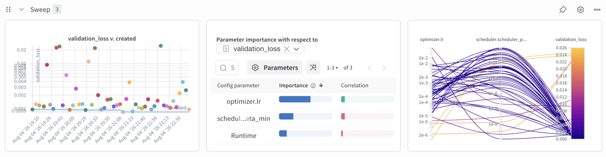

# Run a hyperparameter sweep

This guide walks through running a W&B sweep.
We use Optuna to sample the hyperparameters and we run each trial as an independent job.
Jobs are tracked in a local `sqlite` database, so switching platforms just involves copying the sweep directory.

## Prerequisites

Complete the [training prerequisites](train.md#prerequisites) (W&B login) first.

## 1. Define the search space

Create a search-space YAML, e.g. `example.sweep.yaml`:

```yaml
name: example
n_trials: 8
sampler: tpe
seed: 0
metric:
  name: validation_loss
  goal: minimize
parameters:
  train.optimizer.lr:
    type: float
    low: 1.0e-5
    high: 1.0e-2
    log: true
  loss.delta:
    type: float
    low: 0.1
    high: 2.0
```

`parameters` keys are Hydra dotted override paths, exactly as you'd pass them to `imp train key=value`. Each entry is one of:

- `type: float` / `type: int` — `low`, `high`, optionally `log: true` (log-uniform) or `step`.
  `log` and `step` are mutually exclusive: `type: int` requires `step: 1` (the default) when `log: true`, and `type: float` does not accept a `step` at all when `log: true`.
- `type: categorical` — `choices: [...]`

## 2. Generate the sweep

```bash
uv run imp sweep initialise --sweep-yaml example.sweep.yaml --config-name baseline/02_cnn_unet_cnn
```

!!! note
    `--sweep-yaml` is a full filesystem path, resolved relative to your current working directory (or given as an absolute path).
    This is different from `--config-name`, which resolved relative to `icenet_mp/config/`.

This will create a new W&B sweep and a local directory under `<base_path>/sweeps/<sweep_id>`.
That directory contains the following files:

- `model_config.yaml`: the base `imp` config
- `optuna.yaml`: the sweep config
- `optuna.db`: a record of local trials (not human-readable)
- `sampler.pkl`: the state of the Optuna sampler (not human-readable)
- `sampler.pkl.lock`: a lock file governing concurrent access to `sampler.pkl`

## 3. Run a trial

```bash
uv run imp sweep trial --sweep-path <path to sweep directory created above>
```

This will run a single job registered as part of the W&B sweep.

## 4. Check results

All trials will create a W&B run which can be examined as usual.
They will also create an entry in the W&B sweep which provides an easy comparison between all runs in the sweep.



If you want to run additional trials in the same search space, simply run `uv run imp sweep trial ...` again.
If you want to refine the search space, you will need to create a new sweep with `uv run imp sweep initialise ...`.

## 5. Summarise the best trial

```bash
uv run imp sweep summarise --sweep-path <path to sweep directory created above>
```

This prints the number of completed trials and the value and hyperparameters from the best trial, read directly from the local Optuna study.
Unlike `sweep trial`, it does not need a W&B connection.
