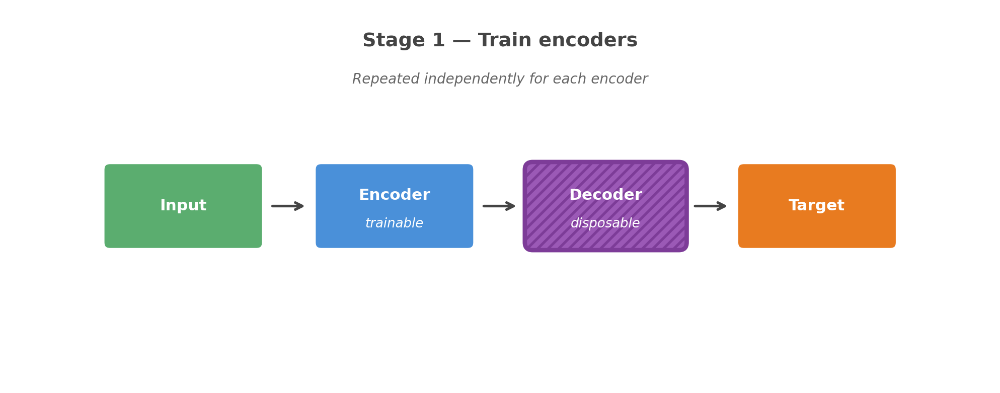
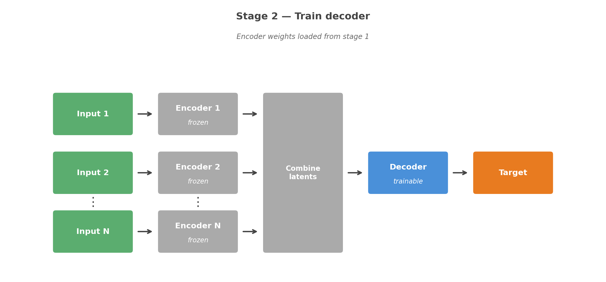
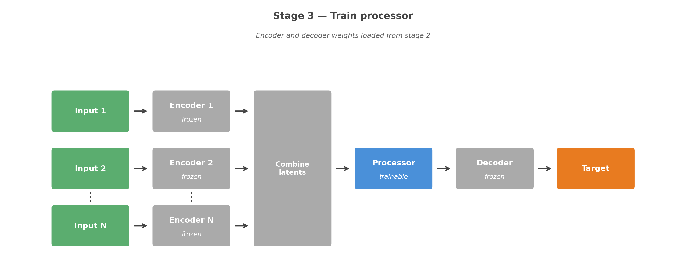
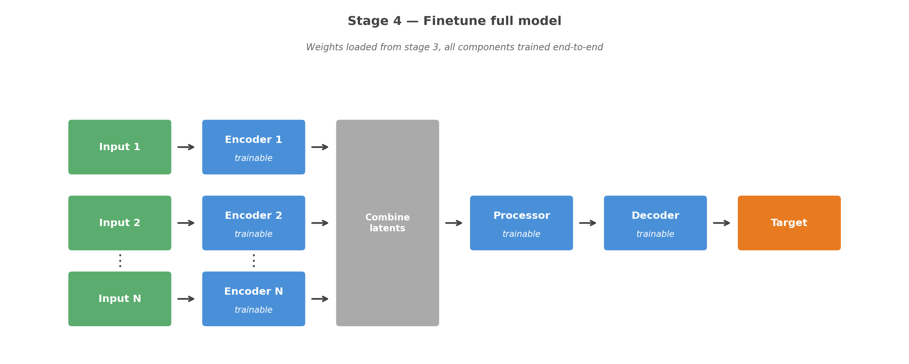

# Run multistage training

Multistage training is an alternative to [normal training](./train.md) for `EncodeProcessDecode` models.
Instead of training the full model in one pass, each component is trained in isolation before the weights are loaded into the full model for a final finetuning step.
This can be useful when the model is large, when encoder inputs have very different characteristics, or when you want finer control over the training of individual components.

## The four stages

**Stage 1 - Train encoders**

Each encoder is trained independently as a standalone autoencoder (encoder + disposable decoder). One training run per encoder.



**Stage 2 - Train decoder**

The decoder is trained on the combined frozen encoder latents from stage 1.



**Stage 3 - Train processor**

The processor is trained with frozen encoders and decoder from stages 1–2.



**Stage 4 - Finetune**

Pretrained weights are loaded into the full `EncodeProcessDecode` model and the entire model is trained end-to-end.



## Running staged training

```bash
uv run imp train --multistage
```

A checkpoint is saved at the end of each stage. To resume a partially completed run, pass `--checkpoint-dir` pointing at the checkpoint directory from the original run - any stage whose checkpoint already exists there will be skipped:

```bash
uv run imp train --multistage --checkpoint-dir ${BASE_DIR}/training/wandb/run-<date>-<id>/checkpoints
```

## Per-stage config overrides

Each stage inherits the top-level `train` config. To override settings for a specific stage, add a `stages` block:

```yaml
train:
  trainer:
    max_epochs: 20
  stages:
    encoders:
      trainer:
        max_epochs: 10      # shorter run for encoder pretraining
    decoder:
      trainer:
        max_epochs: 10
    processor:
      trainer:
        max_epochs: 10
    finetuning:
      optimizer:
        lr: 1e-4            # lower learning rate for finetuning
      trainer:
        max_epochs: 5
```

Any key valid under `train` can be overridden per stage: `optimizer`, `scheduler`, `trainer`, and `callbacks`.
Keys not present in a stage block fall back to the top-level `train` values.
