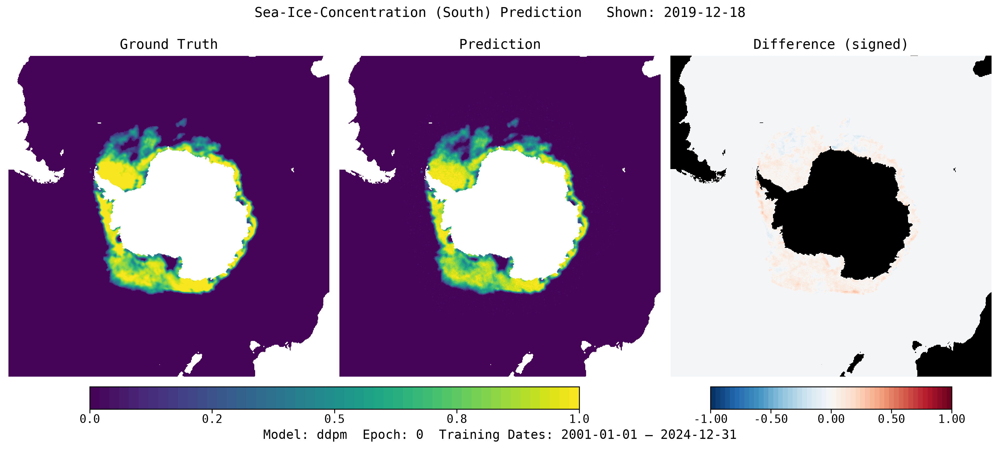

# IceNet-MP

**IceNet-MP** is a multimodal pipeline for predicting sea ice.
It performs multi-modal data fusion across satellite, sensor and post-processed datasets to produce state-of-the-art sea-ice forecasts.



## Getting started

- [User Guide](user-guide/index.md) - installation, configuration, and the `imp` CLI
- [API Reference](api/index.md) - every public module, class, and function

## Quick install

```bash
pip install git+https://github.com/alan-turing-institute/icenet-mp
```

Then run:

```bash
imp --help
```
