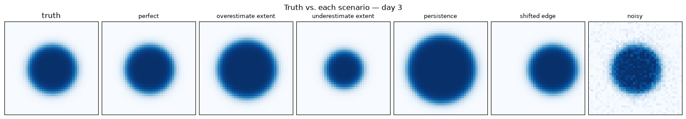
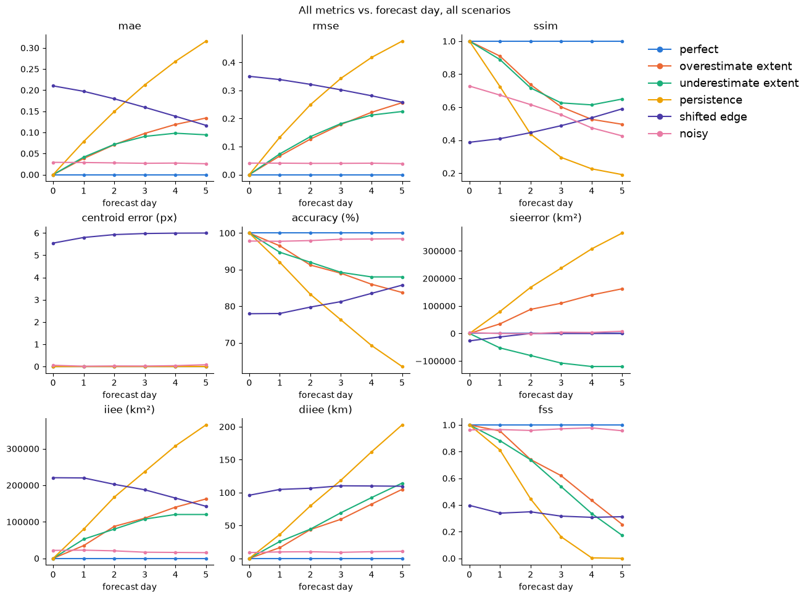
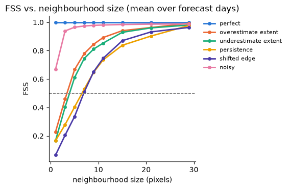

# Metrics

`icenet_mp.metrics` ([API reference](../api/metrics.md)) implements several
`torchmetrics.Metric` classes, each computed per forecast lead time. Using a combination of these metrics it is possible to understand why model results differ.
Here we use six synthetic scenarios to show what each metric actually
captures and what it's strengths and weaknesses are.

## The scenarios

All metrics below are computed against the same synthetic truth (a circular ice cap
that shrinks over six forecast days, standing in for melt) and six prediction
scenarios that each get something different wrong:

| scenario | what's wrong |
|---|---|
| `perfect` | matches the truth exactly (sanity check) |
| `overestimate extent` | melts too slowly — too much ice predicted |
| `underestimate extent` | melts too fast — too little ice predicted |
| `persistence` | naive baseline: day-0 truth repeated at every lead time |
| `shifted edge` | same radius (and area) as the truth, but displaced sideways |
| `noisy` | truth plus small random per-pixel noise |

## Metric summary

| Metric | What it measures | Units |
|---|---|---|
| [`MAEPerForecastDay`](#mae-rmse) | mean absolute pixel-wise concentration error | concentration |
| [`RMSEPerForecastDay`](#mae-rmse) | root-mean-squared pixel-wise concentration error | concentration |
| [`SSIMPerForecastDay`](#ssim) | local structural similarity (luminance, contrast, structure) | score (≤ 1) |
| [`CentroidErrorPerForecastDay`](#centroid-error) | distance between the predicted and true value-weighted centroids | pixels |
| [`IceNetAccuracyPerForecastDay`](#accuracy) | binary ice/no-ice classification accuracy at the 0.15 threshold | % |
| [`SeaIceExtentErrorPerForecastDay`](#sie-error) | signed difference between predicted and true total ice area | km² |
| [`IntegratedIceEdgeErrorPerForecastDay`](#iiee) | area of the symmetric difference between predicted and true ice extent | km² |
| [`DistanceAveragedIceEdgeErrorPerForecastDay`](#diiee) | IIEE normalised by combined edge length, as an average displacement | km |
| [`FractionalSkillScorePerForecastDay`](#fss) | how well the ice edge is positioned within a neighbourhood tolerance | score (≤ 1) |

## Continuous metrics

These are general-purpose metrics for comparing continuous fields, not specific to
sea ice — most originate from image quality or regression evaluation and apply
unchanged to any gridded continuous variable.

### MAE / RMSE

`MAEPerForecastDay` and `RMSEPerForecastDay` compare concentration directly,
pixel-by-pixel, independent of spatial pattern.

**Limitations:** Although these two produce similar rankings, RMSE weights large errors more than MAE, so it separates a few big
misses (`shifted edge`) from many small ones (`noisy`) more sharply than MAE does.
Neither metric distinguishes a coherent structural error from scattered noise with
the same total magnitude — that distinction is what SSIM is for.

### SSIM

`SSIMPerForecastDay` compares fields within a Gaussian-weighted window, combining
local luminance, contrast, and structure (Wang et al., 2004), rather than comparing
every pixel independently.

**Limitations:** SSIM is the one metric here that penalises `noisy` heavily (SSIM ≈
0.58 averaged over the forecast) despite its low MAE/RMSE and high accuracy — independent per-pixel noise
disrupts the local variance/covariance structure SSIM measures even though it
averages out to a small mean error. It broadly agrees with most metrics that `persistence`
and `shifted edge` are worst overall (both systematically wrong at every scale), but
the disagrees sharply on `noisy`, which most metrics rate as one of the *best* scenarios.

### Centroid Error

`CentroidErrorPerForecastDay` measures the Euclidean distance, in pixels, between the
value-weighted centroid ("center of mass") of the predicted and true fields — where
the ice is, not how much of it there is.

**Limitations:** centroid error is blind to size bias by construction: growing or
shrinking a circle around a fixed centre never moves its centre of mass, so
`overestimate extent`, `underestimate extent`, and `persistence` all score ≈ 0
despite being some of the worst-performing scenarios by every area-based metric. `shifted edge` is the only scenario it penalises, converging toward the true
6-pixel displacement as the forecast progresses. Pair it with an area-based metric
(SIE error, IIEE) to separate "wrong amount of ice" from "ice in the wrong place."

## Threshold-based (sea ice) metrics

These metrics have been developed specifically for quantifying errors in sea ice predictions.
They work by first using a threshold (0.15 concentration) to get a binary ice/no-ice
mask and then compare *that*, rather than the raw concentration.

### Accuracy

`IceNetAccuracyPerForecastDay` reports the fraction of pixels that are correctly classified
as either ice or no ice.

**Limitations:** accuracy only cares which side of the threshold a pixel lands on,
not by how much. The `noisy` scenario scores 98 %+ despite non-zero MAE/RMSE, but
`shifted edge` is penalised heavily (~81 % on average) since displaced ice pushes many pixels
across the threshold in both directions.

### SIE error

`SeaIceExtentErrorPerForecastDay` sums total ice area over the whole field and takes
the signed difference from the truth. Positive means the model over-predicts extent.

**Limitations:** SIE error is blind to spatial displacement. `shifted edge` has the
*same* total area as the truth every day, so its SIE error is near zero even though
it is one of the worst scenarios by every other metric — area errors can cancel
across the field even when the field is badly wrong locally. Combine it with a
spatial metric such as IIEE, which does not let displacement errors cancel out.

### IIEE

`IntegratedIceEdgeErrorPerForecastDay` measures the area of the *symmetric
difference* between predicted and true ice extent (Goessling et al., 2016) — every
disagreeing pixel counts, regardless of which side of the truth it's on.

Splitting the disagreement into an over-prediction area `A` (model says ice, truth
says none) and an under-prediction area `B` (model says none, truth says ice) makes
the relationship to SIE error explicit:

- SIE error = `(A − B) × pixel area` — a *signed* net difference, so `A` and `B` can
  cancel.
- IIEE = `(A + B) × pixel area` — an *unsigned* sum, so they never cancel.

IIEE is therefore always ≥ `|SIEError|`, with equality only when the disagreement is
one-sided (`A = 0` or `B = 0`).

**Limitations:** IIEE is a raw area, so its magnitude scales with domain size and
total ice extent — a "good" IIEE for a large, heavily ice-covered domain is a
different number than a "good" IIEE for a small or mostly ice-free one, even for
equally skilled forecasts, so raw values aren't comparable across regions or seasons
(DIIEE's edge-length normalisation exists to address this). IIEE also only reports
*how much* area disagrees, not how that disagreement is distributed spatially: the
same IIEE value can come from a small shift along a long, convoluted ice edge or a
large shift along a short one, so it cannot be read as a literal displacement
distance the way DIIEE can.

**Interpreting alongside SIE error:** the gap between the two is itself diagnostic.
`shifted edge` has near-zero SIE error but the *largest* IIEE of any scenario,
because the displacement creates an over-prediction region on one side of the truth
and an under-prediction region on the other — `A` and `B` are both large but roughly
equal, so they cancel in `A − B` while adding up unchanged in `A + B`. For pure area
biases with no displacement (`overestimate extent`, `underestimate extent`,
`persistence`), only one of `A` or `B` is non-zero, so IIEE tracks `|SIEError|`
almost exactly. Report both together: if they're close, the model has a simple area
bias; if IIEE is much larger, the total amount of ice is roughly right but it's in
the wrong place — something SIE error alone would hide.

### DIIEE

`DistanceAveragedIceEdgeErrorPerForecastDay` rescales IIEE into a length (km) by
dividing by the combined predicted + true ice-edge length, giving a rough "average
displacement" distance.

**Limitations:** DIIEE's denominator (combined edge length) is itself computed from
the current prediction and truth, not a fixed constant like `pixel_size` — so it
moves independently of the underlying error. A change in DIIEE from one lead time to
the next can reflect a genuine change in forecast quality, a change in how much ice
edge there is to normalise against, or both, and there is no way to tell which from
DIIEE alone. DIIEE is also undefined (NaN) whenever both fields have no ice edge at
all — fully ice-covered or fully ice-free — since the denominator is then zero. IIEE
has no such gap: it is always well-defined and correctly reports 0 for a perfect
match in that same case. This matters most near total melt or freeze-up, where DIIEE
can go missing from a lead-time average exactly when IIEE keeps working.

**Interpreting alongside IIEE:** because its denominator is scenario- and
time-dependent, DIIEE is not a fixed rescaling of IIEE — the two curves for the same
scenario can have very different shapes. `shifted edge` illustrates this clearly: its
IIEE declines steadily across the forecast (220,625 km² on day 0 down to
142,500 km² by day 5), which on its own looks like the forecast is improving, but its
DIIEE stays pretty constant at around 105 km. The displacement
itself never changes — the ice cap is always offset sideways by the same fixed
distance — what's actually happening is that the cap is simply melting and getting
smaller, so there is less total area available to disagree over, which is enough on
its own to shrink IIEE even though the underlying positional error hasn't improved at
all. DIIEE divides that same area by the combined edge length, which shrinks for the
same reason, and this approximately cancels the "the whole cap is smaller now" effect
out of the ratio — revealing that the actual displacement has stayed essentially
constant rather than improved.

### FSS

`FractionalSkillScorePerForecastDay` reduces each field to a binary ice-edge map,
then compares the local fraction of edge cells within a
`neighborhood_size × neighborhood_size` window (Roberts and Lean, 2008; Melsom et
al., 2019). A small neighbourhood only forgives sub-pixel jitter; a large one
forgives an edge displaced by many grid cells — computing FSS across a range of
sizes and finding where it crosses 0.5 gives a rough "effective resolution" for edge
position.

**Limitations:** FSS says nothing about *how much* concentration is wrong at a
pixel, only whether the edge is in approximately the right place. `noisy` scores
highest of any imperfect scenario (FSS ≈ 0.97 at a 5-pixel neighbourhood) since the
edge survives small per-pixel noise almost perfectly, while `persistence` and
`shifted edge` are the slowest to recover as the neighbourhood grows, since both are
systematically — not just locally — wrong.

## References

- Goessling, H. F., Tietsche, S., Day, J. J., Hawkins, E., and Jung, T. (2016).
  Predictability of the Arctic sea ice edge. *Geophysical Research Letters*, 43(4),
  1642–1650. [doi:10.1002/2015GL067232](https://doi.org/10.1002/2015GL067232)
- Melsom, A., Palerme, C., and Müller, M. (2019). Validation metrics for ice edge
  position forecasts. *Ocean Science*, 15, 615–630.
  [doi:10.5194/os-15-615-2019](https://doi.org/10.5194/os-15-615-2019)
- Roberts, N. M., and Lean, H. W. (2008). Scale-Selective Verification of Rainfall
  Accumulations from High-Resolution Forecasts of Convective Events. *Monthly
  Weather Review*, 136(1), 78–97.
  [doi:10.1175/2007MWR2123.1](https://doi.org/10.1175/2007MWR2123.1)
- Wang, Z., Bovik, A. C., Sheikh, H. R., and Simoncelli, E. P. (2004). Image quality
  assessment: from error visibility to structural similarity. *IEEE Transactions on
  Image Processing*, 13(4), 600–612.
  [doi:10.1109/TIP.2003.819861](https://doi.org/10.1109/TIP.2003.819861)
